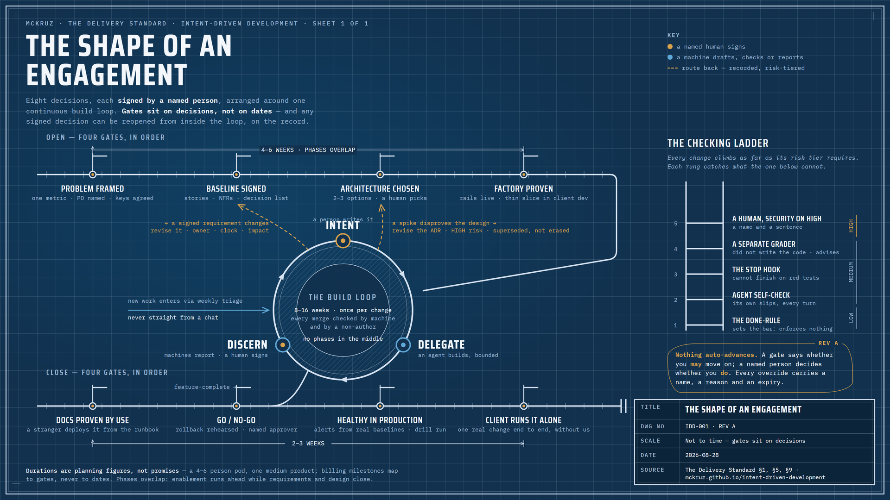

# The Delivery Standard

How we use Claude to build software for clients, start to finish. This is the gold standard for
every engagement: who does what, what Claude does, what the templates are, how source control and
DevOps are structured, and what has to be true before anything merges, ships, or gets handed over.

**Owner:** Matt Kruczek. **Deputy:** named per the rule in section 4 (no role without a deputy).
**Version:** 1.1 (2026-08-28). Changes to this standard go through a PR reviewed by someone who
didn't write it, same as everything else.

1.1 — the site reorganised around Understand / Run / Install; section 5.3b (reopening a decision)
added; section 1 redrawn.

This standard describes the **method as a concept**, kept independent of any one tool. Where it
names a specific tool — the SDLC orchestration plugin we drive it with (`claude-code-sdlc`), the
.NET/Azure stack, a particular CI system — treat that as **an example of how we implement the
method today**, not as part of the method itself. The specific tools and commands appear in full
in the worked examples (the fictional Harbor Mutual engagement that runs alongside each
deep-dive); the concept here should still make sense if you swapped every one of them out.

The method synthesizes two bodies of work: the Intent-Driven Development methodology
(`MCKRUZ/intent-driven-development`) and an SDLC orchestration plugin (`MCKRUZ/claude-code-sdlc`,
our example tool for running the phases). Where the two disagreed, this document is the
resolution; where it is silent, Intent-Driven Development is the tiebreaker.

> **The one rule.** The agent drafts and interrogates; a named human decides and owns. Every gate
> in this standard exists to enforce it: a machine reports, a named human signs.

> **New here?** This document is the full reference and assumes the vocabulary. For a softer way
> in: the [loop cheat-sheet](docs/cheatsheet.md) is the method in 20 seconds, the
> [glossary](docs/glossary.md) defines every term of art used below, the [FAQ](docs/faq.md)
> answers what clients and new pod members ask, and the [anti-pattern field guide](docs/anti-patterns.md)
> is the nine ways it goes wrong. None of them are required to read this — they're the on-ramp.

---

## 1. The shape of an engagement

An engagement has three parts, in order. An **opening** frames the problem and builds the
"factory" — the code repository, the build-and-deploy pipeline, and the set of rules and context
the AI agents work inside. A long **middle** is where the software actually gets built, one small
piece at a time. A **close** documents the system, ships it to production, and hands everything
over to the client.

The opening and the close run as **numbered phases**. Each phase ends at a **gate**: a checkpoint
where automated checks run and a named human has to sign off before the work advances. The middle
is different — it is not phased. It runs as a continuous **build loop**, repeating the same short
cycle for every piece of work.

A traditional software lifecycle phases the middle too: separate Implementation, Quality, and
Testing stages, each finishing before the next starts. We deliberately don't. Checking a large
batch of work only after it has all been built is the failure mode the delivery research warns
about — when AI agents write the code, the volume of code and pull requests can balloon while
delivery gets no faster, because the checking piles up unreviewed. So checking happens **per
change, inside the loop**, never as a later phase.

We run the phased opening and close with an example orchestration tool (the `claude-code-sdlc`
plugin), and only for its phase structure — deliberately with less automation than it offers.
Nothing about the shape below depends on that tool; any phase-gating mechanism that keeps a human
in the loop would do.



Eight signed decisions, in order, around one continuous loop:

- **Open**
  - Problem framed (Discovery) — one metric, PO named, keys agreed
  - Baseline signed (Requirements) — epics, stories, NFRs; drafted by the agent, owned by humans
  - Architecture chosen (Design) — two or three options proposed, one picked and recorded as ADRs
  - Factory proven (Foundation) — harness, rails, and the thinnest end-to-end slice live in client dev
- **The loop** — for every story, Intent → Delegate → Discern, merged and deployed to dev; weekly
  triage, flow check, Retro+; biweekly steering with the client; hardening passes scheduled, not
  phased (section 5)
- **Close**
  - Docs proven by use (Documentation) — a stranger runs the system from the README and the RUNBOOK
  - Go/no-go (Deployment) — rollback rehearsed, then a named human says ship
  - Healthy in production (Monitoring) — alerts from real baselines, the incident drill run, the retro held
  - Client runs it alone (Close & Transfer) — the client team runs a spec end to end without us driving

Gates sit on decisions, not on dates. A signed decision can be reopened from inside the loop
(section 5.3b) — what the standard forbids is the quiet version, code that drifts from a decision
nobody updated.

Phase advancement is **always manual**. Any auto-advance the orchestration tool offers is turned
off. Gates tell you whether you _may_ advance; a named human decides whether you _do_.

> Deep-dives, each phase day by day (who is involved, every artifact with its owner and
> done-condition, the cadences, the exit gate), with the Harbor Mutual worked example running
> alongside:
>
> - `docs/phase-0-discovery.md` + example `docs/phase-0-example.md`
> - `docs/phase-1-requirements.md` + example `docs/phase-1-example.md`
> - `docs/phase-2-design.md` + example `docs/phase-2-example.md`
> - `docs/phase-3-foundation.md` + example `docs/phase-3-example.md`
> - `docs/build-loop.md` — the Build loop that runs between the opening and closing phases
>   (+ example `docs/build-loop-example.md`)
> - `docs/the-rails.md` — the CI/CD and DevOps pipeline every change rides, as a standing
>   standard: the five workflows, the merge bar, deploy and promotion, the agent-safe IaC
>   pipeline, and the one principle (agent proposes, gate disposes)
>   (+ example `docs/the-rails-example.md`)
> - `docs/phase-7-documentation.md` + example `docs/phase-7-example.md`
> - `docs/phase-8-deployment.md` + example `docs/phase-8-example.md`
> - `docs/phase-9-monitoring.md` + example `docs/phase-9-example.md`
> - `docs/phase-c-close.md` + example `docs/phase-c-example.md`

Rough calendar for a typical engagement (4-6 person pod, medium-sized product): Open 4-6 weeks
(the phases overlap — the Setup Owner's enablement work runs ahead while requirements and design
close), Build 8-16 weeks, Close 2-3 weeks. These are planning figures, not promises; the SOW maps
billing milestones to phase gates, not to dates (section 12).

---

## 2. The human/AI collaboration model, phase by phase

The single most important rule: **The agent drafts and interrogates; a named human decides and
owns.** Our orchestration tooling can automate much of this; we deliberately run it with less
automation than it offers. The table below is the contract for every phase: what the human drives, what Claude
does, and where the mandatory stops are.

| Phase              | Human drives                                                                                                       | Claude does                                                                                                                                                | Mandatory human stops                                                                                            |
| ------------------ | ------------------------------------------------------------------------------------------------------------------ | ---------------------------------------------------------------------------------------------------------------------------------------------------------- | ---------------------------------------------------------------------------------------------------------------- |
| 0 Discovery        | Sponsor states the problem and the one success metric. Pod Lead runs the outcome workshop.                         | Interrogates: surfaces unmade decisions, drafts constitution/problem-statement/constraints from workshop notes, runs document intake on client RFPs/specs. | Problem framing is human-authored. Claude never invents the problem. Phase advance.                              |
| 1 Requirements     | PO (client or proxy, per the Phase 0 decision) owns stories and priorities. Pod Lead enforces Definition of Ready. | Drafts candidate epics/stories from the brief, generates the decision list ("you haven't decided X, Y, Z"), drafts NFRs with measurement basis.            | Every silent decision on the decision list gets a human answer before the story is Ready. Phase advance.         |
| 2 Design           | Architect owns the design and signs every ADR.                                                                     | Researches options, presents 2-3 architectures with concrete trade-offs, drafts ADRs after the human picks, drafts API contracts.                          | Architecture selection. Each ADR. Phase advance.                                                                 |
| 3 Foundation       | Setup Owner builds and owns the harness. DevOps access negotiated with client.                                     | Scaffolds the repo from the kit, writes Bicep, writes pipeline YAML, implements the thin first feature through the full loop.                              | Pipeline and IaC are HIGH risk: human review on every change. Exit gate demo: one feature running in client dev. |
| Build loop         | Pod Lead triages and tiers specs. Orchestrators run agents. Checkers judge.                                        | Everything in section 5: plans, builds, self-checks, grades (as a separate grader), drafts test suites.                                                    | Plan approval before build. Checker approval before merge. Named sign-off on HIGH risk.                          |
| 7 Documentation    | Humans verify docs by following them cold (can a new person deploy from the RUNBOOK?).                             | Drafts README, API docs, RUNBOOK from the codebase and specs.                                                                                              | Docs verified by use, not by reading. Phase advance.                                                             |
| 8 Deployment       | Release manager (usually Setup Owner) owns the promote decision.                                                   | Drafts release notes from merged specs, runs smoke tests, prepares rollback plan.                                                                          | Go/no-go to production. Always.                                                                                  |
| 9 Monitoring       | Pod Lead + client ops define what "healthy" means.                                                                 | Drafts alert definitions, monitoring config, incident runbooks.                                                                                            | Alert thresholds confirmed against real baseline data.                                                           |
| C Close & Transfer | Pod Lead runs the transfer. Client team runs the loop solo, observed.                                              | Generates the final handoff report, audits the harness for anything undocumented.                                                                          | Close gate: client completed a real spec end-to-end without us driving.                                          |

### The discipline seats

The table above names the pod's roles. Four further seats exist for the disciplines a feature draws
on, and each one drafts a specific artifact that a named human signs. They are **conditional, not
optional**: when the trigger applies, the artifact exists before the gate closes and its owner has
signed it; when it does not apply, the phase report says so.

| Seat | Trigger | Drafts (the agent proposes) | A named human signs | Phase |
| ---- | ------- | --------------------------- | ------------------- | ----- |
| **Product** | An epic spans more than one customer surface or persona, or needs carving into buildable specs | The **feature brief**: one epic decomposed into features and specs, each row carrying its channel and persona; shared logic split out as channel-agnostic specs. **One channel per spec.** | The decomposition and the proposed risk tiers | 1 Requirements |
| **Business requirements** | The feature encodes policy — eligibility, pricing, coverage, entitlement, anything with a rule book | **Business rules** as a decision table (condition → outcome → source → approver) and **golden scenarios** (input → expected behaviour). Each rule becomes an acceptance check on the spec; each scenario seeds the golden set (section 11). | Each rule's outcome, by its named approver. A rule whose outcome nobody has decided is a decision-list item, never a guess. | 1 Requirements |
| **Data** | The feature reads or writes customer or personal data, or depends on data nobody has checked is there | The **data contract** (every field, with a PII column), the **readiness** assessment (advisory), and the **lineage** (source → transform → sink, with retention and audit points) | The PII classification — a risk-tier driver: a spec touching personal data is HIGH (section 5.1). Readiness gaps become decision-list items. | 2 Design |
| **Design** | The feature has a customer surface — a screen, a voice line, a chat thread | The **user journey** (including abandon and failure paths), the **surface layout** (screens, or a turn-script, or a message flow), and the **interaction contract** for that channel | The journey and the contract, co-signed by Engineering where the contract is an API | 2 Design |

**Channels.** A channel is the customer surface a capability is delivered through, not the logic
behind it. The same business logic on a different channel is a different product, because each
surface has its own acceptance dimensions: a voice line needs barge-in and readback, a screen needs
confidence display and approval, a chat thread needs threading and safe handling of quoted content.
So the toolchain carries a small library of channel descriptors, each listing its acceptance
dimensions and a risk floor (which may raise a spec's tier, never lower it). At Intent, a surface
spec is bound to exactly one channel and inherits that channel's dimensions as concrete acceptance
checks.

Discipline sign-offs are recorded at the phase advance beside the phase's own signature — who signed
which section, by name. In our toolchain the seats are `/sdlc-feature`, `/sdlc-rules`, `/sdlc-data`
and `/sdlc-experience`, and the binding is `/sdlc-channel`; each is interview-driven, proposes, and
stops at a human confirmation. The concept is the seat, the artifact and the signature, not the
command.

---

## 3. The team

> Deep-dive: `docs/team.md` — the old-role-to-new-role mapping (PM, Architect, 2 devs, QA),
> the concrete job of each role, and the scaling model from one pod to many.

Designed for a 4-6 person pod running 2-3 parallel work streams. The constraint on parallelism is
**checking capacity, not headcount** — never open more agent streams than the team can review
without the queue growing.

### Roles

| Role                    | Owns                                                                                                    | Notes                                                                                                                                |
| ----------------------- | ------------------------------------------------------------------------------------------------------- | ------------------------------------------------------------------------------------------------------------------------------------ |
| **Pod Lead**            | Intent. Stories become ready specs. Risk tiers. The decision list. Client steering.                     | Runs intent triage. Interface to the client PO (or plays proxy-PM in proxy mode, with the ratified decision log).                    |
| **Setup Owner**         | The harness as a product: CLAUDE.md, skills, agents, hooks, settings, pipeline, IaC, the kit install.   | Names a deputy on day one. Deputy reviews all harness changes (the Setup Owner is never sole approver of their own foundation work). |
| **Orchestrators (2-3)** | Running the build loop. Translating ready stories to specs. Approving agent plans. Driving integration. | They do not type most of the code. Their craft is bounds, plan correction, and the one-agent-vs-many call.                           |
| **Checkers**            | The verdict. Grading changes against the spec, reading the CI grader's output, owning the merge.        | Not a separate headcount: Orchestrators and Checkers swap per change. The author of a change is never its checker.                   |
| **Sponsor-side**        | The client sponsor owns the outcome and the metric. The client PO (if committed) owns stories.          | Their obligations are written into the SOW (section 12).                                                                             |

### Collapse rules (smaller engagements)

- 3 people: one person is Pod Lead + Setup Owner (deputy duty moves to the senior Orchestrator);
  two Orchestrator/Checkers swap per change. One stream, two at most.
- 2 people: only with an experienced pair, one stream, and the grader-in-CI carrying more weight.
  The rule that survives all collapsing: **the author of a change never solely approves it.** One
  bounded exception exists, and only for our own internal repos, where a single maintainer has no
  second person to satisfy; its terms — and the mechanical rungs that stand in for the missing
  reviewer — are written in [the team deep-dive](docs/team.md). It never applies to client work.

### Certification

Two bars, and they are different in kind. **Method competence** transfers between engagements;
**system understanding** does not, and has to be re-earned on every codebase.

**Method competence** (once, then it travels). Nobody works a client spec until they have
completed the IDD course (2-day format, `intent-driven-development/course/`) and passed the
competency rubric: demonstrably wrote a spec that passes the vague-line test, ran the full loop on
a practice feature, and operated the grader. Demonstrated, not attested. The practice ground is
internal projects, never client-billed work.

**System understanding** (per engagement, before working a spec unsupervised). An Orchestrator or
Checker demonstrates, out loud and without reading from the docs:

- the system's architecture and its main data flows;
- the layer *beneath* the one they work in — the queue, the identity provider, the deployment
  target — well enough to say how it behaves when it fails;
- for a given spec, what the agent is most likely to get wrong here, and why.

This bar exists because the method can manufacture its own worst failure mode: someone fluent in
the ceremony, steering confidently, without the understanding to notice the model is wrong. The
checking ladder does not save you — rung 5 is a human exercising judgment, and judgment without
understanding is a rubber stamp. The model's working memory is finite and far smaller than a
person's, so the human is the one who has to hold the whole picture.

The natural checkpoint is the Phase 3 exit: the pod has just built the foundation, so it is the
cheapest moment to prove they understand it. Re-established when someone joins mid-engagement.

---

## 4. Source control and repository topology

### Where everything lives

- **Delivery repo** — in the **client's GitHub/ADO org from day one**. Contains the product code
  AND the harness (`CLAUDE.md`, `.claude/`, `specs/`), versioned together. Handoff at close is
  trivial: revoke our access. Their security team can audit everything from week one.
- **`MCKRUZ/intent-driven-development`** (this repo) — **public**, ours. The gold standard docs
  plus the installable kit (section 10). Installed into the client repo at Phase 3; improvements
  harvested back after every engagement. Client-specific harness content stays with the client;
  generalized craft compounds with us. The SOW carves this out explicitly (section 12).
  Because the repo is public, nothing client-identifying ever lands here — the harvest rule in
  section 10 (strip client specifics before generalizing) is a confidentiality control, not just
  tidiness. The same applies to `MCKRUZ/claude-code-sdlc`, which is also public.

There is no separate per-client "system repo." The harness rides inside the delivery repo so
agents always load it, harness changes are PRs reviewed like code, and nothing needs syncing.

### Phase 0/1 checklist additions (because we're guests in their org)

- [ ] Contributor access for the pod; admin on branch protection for the Setup Owner (or a named client admin who applies our policy)
- [ ] GitHub Actions enabled; permission to add workflows and secrets (Anthropic API key, Azure credentials)
- [ ] Runner policy agreed (hosted vs self-hosted)
- [ ] Client's required org policies documented as constraints in the Phase 0 artifacts

### Branching and PRs

Trunk-based. **One spec = one branch = one PR.**

- Protected `main`. Branch per spec: `spec/0007-rate-limiting`.
- The spec file (`specs/0007-rate-limiting.md`) is part of the PR diff, so the reviewer sees
  intent and implementation in one view.
- Squash merge, conventional commit title (`feat: rate limiting per api key (spec 0007)`), branch
  deleted on merge.
- Branch protection requires: CI green (build, tests, lint, coverage), the grader check has run,
  and at least one non-author approval. HIGH-risk PRs carry a `risk:high` label that requires the
  security workflow plus a named human sign-off recorded in the PR.
- PRs stay small because specs are gated small at Definition of Ready. If a spec won't fit in a
  reviewable PR, it gets split at triage, not at review.
- GitFlow only where a client policy forces it, recorded as a deviation in the engagement log.

---

## 5. The build loop

> Deep-dive: `docs/build-loop.md` — the loop end to end: the three beats, the checking
> ladder, the weekly cadences, the client's view, and the metrics that steer it.

This is the middle of the engagement — it replaces the batch Implementation/Quality/Testing phases
of a traditional lifecycle. Every story runs the same three beats.

### 5.1 Intent

A story enters the loop only through **Definition of Ready**, enforced at weekly intent triage:

- Acceptance criteria pass the vague-line test (could two people build different things from this
  line? then it's not ready)
- Scope in / scope out stated
- Silent decisions answered (no open decision-list items for this story)
- Risk tier assigned by the Pod Lead (taxonomy below), recorded in the spec
- References the harness context the agent will have
- Carries its discipline inputs (section 2, the discipline seats): a story with a customer surface
  is bound to one channel and inherits that channel's acceptance dimensions as checks; a story that
  encodes policy traces its checks to signed business rules; a story touching personal data takes
  its tier from the data contract's PII classification

The Orchestrator translates the ready story into `specs/NNNN-name.md` using the kit's spec
template: Goal, Why, Scope in/out, Acceptance checks, Risk tier, Delegation plan (what the agent
may touch, what's gated), Checking plan (which ladder rungs).

**Risk taxonomy** (lives in CLAUDE.md so agents see it too; challenges escalate up, never down,
without discussion):

| Tier   | What lands here                                                                                                                                                                                   | What it triggers                                                                                   |
| ------ | ------------------------------------------------------------------------------------------------------------------------------------------------------------------------------------------------- | -------------------------------------------------------------------------------------------------- |
| HIGH   | Auth/identity, payments, PII/client data handling, schema migrations, public API contract changes, IaC/pipeline changes, prompt/model/tool-definition changes (section 11), **ADR revisions** (section 5.3a), anything hard to undo | Tight agent permissions, full ladder, security-reviewer agent pass, named human sign-off in the PR, repetition dial (section 14) |
| MEDIUM | New business logic, external integrations, changes to shared internal services                                                                                                                    | Standard permissions, grader + human Checker                                                       |
| LOW    | UI within existing patterns, copy, internal tooling, additive CRUD on established rails                                                                                                           | Lighter review; grader + mechanical gates still run                                                |

**Bug-fix specs carry one extra mechanical gate.** Coverage proves a test exists; it does not
prove the test would have caught the bug. A fix labelled `type:bugfix` must ship a test that
**fails against the code as it was before the fix** — proven in CI by the `repro-gate` job, which
reconstructs the pre-fix tree with the new test applied and requires it to go red. There is no
label escape: a test that cannot fail cannot protect anything. Feature specs are exempt because
there is no "before" state to fail against.

### 5.2 Delegate

- Start in plan mode. The agent proposes; the Orchestrator corrects or approves **before** code.
- Bounds set per spec: scope (file patterns it may touch), context (the one canonical pattern to
  reuse), permissions (`.claude/settings.json` auto-allows `dotnet test`, `dotnet build`,
  `ng test`, lint, reads; asks on package installs, network, and anything under gated paths like
  migrations or auth).
- One agent for tightly coupled code. Fan out only for independent, read-only exploration or for
  genuinely independent specs on separate branches.
- A blocking Stop hook (from the kit) refuses to let the agent finish with failing tests or a
  broken build. This is the single highest-value automation we keep.

### 5.3 Discern

- **Mechanical gates in CI** (hard blocks): build, tests, lint, 80% coverage on new code.
- **Grader in CI** (required to run, advisory verdict): a GitHub Actions workflow runs
  claude-code-action; a fresh agent that did not write the code reads the spec file in the diff
  and posts a check-by-check verdict as a PR comment. It cannot be skipped — "grader has run" is a
  required status check — but its verdict does not block. The human Checker reads it and makes the
  call. Machines gate the mechanical; humans own the judgment.
- **Human Checker** (hard block): non-author approval on every PR. On HIGH risk, additionally the
  security-reviewer agent's pass and a named human sign-off.
- Merge deploys to the client dev environment automatically (the rails from Phase 3).

### 5.3a Spikes (when a story can't be made ready)

A story sometimes fails Definition of Ready for a reason no amount of rewriting fixes: nobody
knows the answer yet. The integration's real behavior is undocumented; the design rests on an
assumption no one has tested. Acceptance criteria written about an unknown are fiction, and the
grader will grade them as if they weren't.

A **spike** is the second delegation mode, and it is not a spec:

- Boxed in time or tokens, agreed at triage, recorded.
- Run on a `spike/` branch. A required CI check (`spike-guard`) fails any PR opened from one, so
  the merge button never lights up. The throwaway rule is mechanical, not honour-based — spike
  code has climbed none of the checking ladder, so "it started as a spike" must never be a route
  onto `main`. Unlike the spec gate, this check has no label escape; work worth shipping gets a
  spec and gets rebuilt.
- Its deliverable is a written finding (`kit/spike-template.md`): what was assumed, what was
  tested against which system, what was found, whether the assumption survived. The finding is
  committed; the code is deleted.
- It closes a named unknown — a decision-list item or a risky assumption — and unblocks the spec
  that was stuck. When it invalidates a Phase 2 decision, the ADR revision that follows is a
  HIGH-risk spec like any other.

Spikes are how the design gate stays honest rather than becoming a fiction: Phase 2 decides, and
evidence found later is allowed to change the decision through a gated route.

> Deep-dive: `docs/build-loop.md` §3a.

### 5.3b Reopening a decision (when something learned changes a signed gate)

A gate signs a decision, not a date, and the loop is where most of what changes a decision gets
learned. Three routes exist, and every one of them leaves a record:

- **New work** — the normal case. It enters through weekly intent triage as a story, gets a spec,
  and rides the loop like everything else. Nothing upstream is reopened.
- **A design decision is disproved.** A spike produces the finding (section 5.3a); the ADR is
  revised as a HIGH-risk spec and the old record is marked superseded, so the history shows both
  what was decided and why it changed.
- **A signed requirement changes** after the Phase 1 baseline. It is revised in place with a named
  owner, a written reason, the two-business-day decision clock, and the downstream artifacts it
  touches listed (design, specs, tests, docs); then the phase's gate is re-run so the change is
  visible rather than absorbed. When a merged change has drifted from its requirement, the same
  route runs in reverse — the merged work proposes the upstream edit, and a named human confirms
  it.

Reopening a Phase 0 decision — the problem, the metric, the PO mode, the tooling — is the most
expensive kind, and it is a SOW conversation rather than a triage item: billing milestones map to
gates (section 12), so moving the frame moves the money.

Every pre-Build artifact keeps a content history: what it said at each version, who changed it and
when, and the ability to diff two versions or roll one back when a revision went wrong. That history
is what makes "superseded, not erased" a fact rather than a habit.

In our toolchain this is `/sdlc-revise` (one artifact, owner and clock, re-gate, blast radius
shown), `/sdlc-refresh` (back-propagation after a merge) and `/sdlc-version` (the content history:
list, diff, roll back); the concept is the recorded reopening, not the command.

What is never allowed is the quiet drift — code that no longer matches a decision nobody updated.

### 5.4 Weekly cadence

| Meeting            | Length    | Replaces   | Output                                                                                            |
| ------------------ | --------- | ---------- | ------------------------------------------------------------------------------------------------- |
| Flow check (daily) | 10 min    | standup    | A Checker assigned to every waiting change; vague specs flagged; WIP cap enforced                 |
| Intent triage      | 60 min    | refinement | Stories -> ready specs; risk tiers; decision lists answered                                       |
| Retro+             | 60 min    | retro      | Every escaped bug answered with "which check should have caught it?"; harness improvement backlog |
| Setup review       | 30-60 min | (new)      | Versioned harness changes merged; Setup Owner's deputy reviews                                    |

### 5.5 Client cadence

Biweekly 45-minute steering: live demo of working software in the dev environment, the outcome
scorecard (their success metric, the DORA stability pair (change-fail rate and time-to-recover),
the accepted-as-is trend), the decision
list needing their answers, and gate status when a phase boundary is near. Weekly 5-bullet async
summary in between. **No activity metrics in client materials, ever** — no PR counts, no "AI
productivity" claims. Demos and outcomes only. The durable record is the HTML phase report our
tooling generates at each gate.

### 5.6 Hardening passes

Quality is per-change, but integration-level concerns (performance under load, E2E journeys,
penetration testing) run as scheduled hardening passes — typically one mid-Build and one before
Phase 8 — driven by end-to-end and security tooling (in our toolchain, the `/e2e` workflow). These
are scheduled work in the flow, not a phase that gates all other work.

---

## 6. The harness standard

> Cross-phase reference: [`docs/companion/artifact-flow.html`](docs/companion/artifact-flow.html) — what
> each phase receives and produces, where every file lives, and the handoff chain end to end. Each phase's
> final required artifact is named for the phase that consumes it.

What every client delivery repo contains after kit install (Phase 3). The harness is a product:
versioned, owned by the Setup Owner, changed only by reviewed PR.

```
client-repo/
├── CLAUDE.md                  # from kit template: stack standards, domain glossary, risk
│                              # taxonomy, Definition of Ready/Checked, spec conventions,
│                              # gated paths, "done means the hook lets you stop"
├── specs/                     # one file per feature: NNNN-name.md, the source of truth
├── .mcp.json                  # team MCP server set; packs merge stack/CI additions
├── docs/harness.md            # developer-facing tour of the installed harness (kit HARNESS.md)
├── .claude/
│   ├── settings.json          # permission rules: auto-allow safe, ask on gated
│   ├── skills/                # spec-writer, test-writer, api-pattern, pr-writer,
│   │                          # eval-builder, diagnose
│   ├── agents/                # planner, architect, grader, security-reviewer,
│   │                          # build-error-resolver, debugger (+ ux-reviewer via a frontend pack)
│   └── hooks/                 # stop-gate, review-gate, save-review-receipt (.ps1 + .sh each);
│                              # stop-gate blocks finishing on a red build/tests;
│                              # sensitive-edit-nudge = advisory example, installed unregistered
├── .github/
│   ├── RAILS.md               # operator's guide + shakedown drills
│   ├── CODEOWNERS
│   ├── profile/rubrics/       # grader.md, correctness.md, security.md — workflows read these
│   ├── rulesets/              # branch-protection.json (applied via scripts/rails/)
│   └── workflows/
│       ├── ci.yml             # secret scan, build, test, coverage — hard gates
│       ├── grader.yml         # claude-code-action grader, posts PR comment; required to RUN,
│       │                      # verdict advisory (never blocks)
│       ├── correctness.yml    # fresh agent (≠ grader, ≠ author) hunts changed lines for logic
│       │                      # defects; blocks on a high-confidence defect, named override on record
│       ├── security.yml       # security-reviewer on gated paths or risk:high label; blocks on HIGH
│       ├── deploy-dev.yml     # merge to main -> client dev environment
│       └── eval-*.yml         # eval-regression + eval-suite (§11 agentic work)
├── scripts/rails/             # diff-anchors.sh, apply-branch-protection.sh
├── eval-datasets/ + prompts/  # golden-set template + versioned judge prompts (§11 work only)
├── infra/                     # Bicep: dev environment first, test/prod added at hardening
└── .sdlc/                     # orchestration-tool state, artifacts, phase reports (committed)
```

CLAUDE.md contents (the kit template, adapted per client in week one): what the project is, the
domain glossary in the client's words, the .NET/Angular/Azure standards (from the
microsoft-enterprise profile and our global coding rules), the spec convention, the risk taxonomy,
what requires plan approval, what paths are gated, and the Definition of Checked. An empty or
stale CLAUDE.md means agents guess, and guesses differ per run — keeping it current is Setup Owner
work, reviewed at setup review.

### The model-generation review (what should we delete?)

Setup review is additive by nature: it processes the week's improvements. Nothing in the cadence
ever asks what should come *out*. That matters, because a large share of any harness exists to
compensate for model limitations — and those expire. The vendor's own teams have deleted the bulk
of a major agent's instructions once the model outgrew the need for them.

So the Setup Owner runs a **model-generation review**, triggered by a new model family rather than
by the calendar. It re-tests the harness's load-bearing assumptions:

- CLAUDE.md — what is still earning its place, and what is now telling the model something it
  already knows?
- Which hooks remain necessary, and which now block behaviour the model gets right unaided?
- Is plan-mode-always still right at every risk tier?
- Do the agent definitions still describe things the base model cannot do?

The output is a PR that **deletes as well as adds**, reviewed by the deputy like any other harness
change.

> **The principle underneath it.** Scaffolding that hedges model weakness should be expected to
> shrink; scaffolding that carries human accountability should not. The Stop hook and the coverage
> floor are the first kind and will eventually look quaint. The non-author approval and the named
> sign-off are the second kind — they encode who is answerable, which no model improvement
> retires. Sorting the harness into those two piles is the review's real job.

---

## 7. DevOps

> Deep-dive: `docs/the-rails.md` — the CI/CD and DevOps pipeline as a standing standard: the
> five workflows, the merge bar, deploy and promotion, the agent-safe IaC pipeline, agents working
> inside the pipeline, and the governing principle (agent proposes, gate disposes).

- **Stack default:** .NET 8 / Angular / SQL Server / Azure / GitHub Actions — the example profile
  we ship. A profile-swap appendix in this repo covers what changes for other stacks; everything
  else in this standard is stack-independent.
- **IaC:** Bicep, in-repo, HIGH risk tier. Dev environment provisioned in Phase 3; test and prod
  added at the first hardening pass; prod promoted in Phase 8.
- **Pipeline ownership:** Setup Owner builds it (with Claude drafting the YAML); the client's
  DevOps/security reviews it — they have to operate it after we leave.
- **Secrets:** client's Key Vault and client's GitHub secrets. Never in code, never in CLAUDE.md,
  never in specs. The Anthropic API key is client-procured (section 8).
- **Third-party components:** most of what ships is code nobody on the pod wrote, and it decays —
  a package that was clean on the day it landed becomes an advisory later, with no commit to
  mark the moment. The position has three parts, and the split between the first two is the
  whole design:
  - **A change may not introduce a known-vulnerable package.** The `dependency-gate` CI check
    scans this branch and the target branch and blocks on the difference. Diff-scoped like every
    other gate, so a CVE published overnight in untouched code never reddens work nobody caused
    — a check that is red for reasons outside your control teaches the team that red is normal,
    and that costs us every other gate's credibility.
  - **What is already here is found weekly and raised as an issue, not a block.** The
    `dependency-scan` workflow reports the standing stock; the fix rides the normal rails as an
    ordinary spec with a risk tier, prioritised by a human. Upgrading anything touching auth,
    payments, or client data is HIGH risk like any other such change (section 5.1).
  - **Upgrades are proposed automatically and reviewed like any change.** Dependabot opens the
    PRs; they clear the full merge bar, and nothing auto-merges. "The bot wrote it" is not a
    reason to skip review — a dependency upgrade is a behavioural change to code we did not
    write, which warrants more scrutiny than a colleague's diff, not less.

  Accepting a vulnerability instead of fixing it is a recorded decision, not a silence: the
  `accepted-risk:dependency` label clears the gate for one PR, and `dependency-exceptions.md`
  carries the reason, the reachability assessment, a named person, and an expiry date. Expired
  acceptances are swept at the Setup review (section 5.4).

  **Platform caveat, stated plainly:** Azure DevOps has no first-party Dependabot — it is a
  marketplace extension there, and installing a third-party extension with repo write access is
  the client's decision, not ours to make quietly. On that platform the first two parts hold and
  the third is manual until they choose. We say so rather than shipping a pipeline that silently
  does less than its GitHub twin.
- **Environments:** merge -> dev (automatic), dev -> test (on demand, smoke-tested), test -> prod
  (Phase 8 ceremony and thereafter on the client's release cadence, human go/no-go every time).
  Two workflows, deliberately separate: `deploy-dev` is automatic and unattended; `deploy-promote`
  is manual-trigger only and cannot run without a named approver, because promotion beyond dev is
  the standard's most protected stop. The go/no-go is the target environment's own approval
  mechanism (GitHub required reviewers / Azure DevOps environment checks) rather than anything
  hand-rolled — the client's security team can already audit it, and `deploy-promote` refuses to
  run against an environment that has no approver configured. Neither workflow rebuilds: both ship
  the exact artifact a named CI run produced, and a promotion is rejected unless the source
  environment has already run those same bytes.
- **Rollback:** every deploy captures the last known-good version and restores it on failure. The
  human path — the deploy that succeeded and went wrong an hour later — is written down in advance
  in `ROLLBACK.md` (`kit/rollback-template.md`), including what a rollback does **not** undo, and
  is proven by the client's own operators rehearsing deploy -> roll back -> redeploy in test.

---

## 8. Claude access and the data boundary

Resolved in Phase 0, before anyone opens a terminal:

1. **Default:** the client procures Anthropic access (API or Claude for Work) under their own
   agreement, with Anthropic's standard no-training-on-API-data terms. Keys live in their Key
   Vault / GitHub secrets. The pod works on client-issued seats. Their contract, their keys,
   their audit trail. The kit includes a one-page data-flow brief for their security team:
   what goes to the API (code context from the repo, specs), what doesn't (we tag genuinely
   sensitive material out of agent context), where keys live, who can see usage.
2. **Fallback** (procurement stalled): our firm's keys with a signed client consent rider,
   migrated to client keys as soon as procurement lands.
3. **High-compliance path:** Claude via the client's Azure tenant (Microsoft Foundry). Verify
   current model availability and Claude Code compatibility at Phase 0 before promising it.

Model policy default — **the strong model goes on the checking side, not the writing side**:

| Work | Model |
| ---- | ----- |
| Plan mode and design | strongest available |
| Implementation | standard |
| Grader, correctness pass, security reviewer | strongest available |

Most of the effort in agent-built work is verification, not typing — a reported large-scale
migration split roughly 15% producing the code against 85% making it correct and proving it. The
rung that catches what the author was blind to is the one worth resourcing. Independence still
comes from the checker not having written the code; model tier buys capability, which is a
separate axis, and we now buy both.

This means the pod deliberately spends more on checking a change than on writing it. Expect the
question from any client holding the keys, and answer it plainly: the expensive part of the work
is being sure, and that is where the money should go. Token spend is a client-visible cost once
they hold the keys — the Setup Owner watches it and it appears in the internal dashboard, never as
a client-facing productivity claim.

---

## 9. Gates and metrics

### Phase gates

At every phase boundary an automated gate check runs a fixed battery of validations (integrity,
completeness, metrics, compliance, consistency, quality). Gates report; a named human advances.
(In our toolchain this is the `/sdlc-gate` check — the concept is the battery plus the human, not
the command.) Override rules: the mechanical gates are never overridden; a quality-gate override
requires written justification recorded with the phase state. A gate can also be re-run because
a signed decision was reopened (section 5.3b); the re-run is recorded like any other gate outcome.

### Merge gates

Per section 5.3. Exceptions (a true emergency merge past a gate) require the Pod Lead and one
other human, a `gate-exception` label, and a Retro+ agenda item. Two exceptions in a month means
the gate or the specs are wrong — fix that, don't keep excepting.

### Metrics

Internal dashboard (baseline-and-trend, no vanity targets):

- **Accepted-as-is rate** — agent work merged without rework. The trust signal.
- **Review wait (median)** — the real bottleneck indicator. If it grows, stop opening streams.
- **Rework/revert rate** and **bounce-back-for-unclear rate** — intent quality signals.
- **Escaped bugs** — every one gets a "which check should have caught it?" answer at Retro+.
- **DORA four** — deploy frequency, lead time, change-fail rate, time-to-recover.
- **Security-review wait** — tracked separately; it clears slower and would hide in an average.

When a metric has no data yet, report **"no data"** — never a fabricated zero. A zero reads as a
measured result (zero escaped bugs, zero review wait) and steers the room wrong; "no data" tells
the truth, that nothing has been recorded to read.

Never tracked, never reported: velocity, story points, PR count, lines of code. Agents inflate
all of them, and the published delivery research shows PR volume can double while delivery stays
flat.

Client-facing scorecard: their success metric, the DORA stability pair, accepted-as-is trend,
and the demo. That's it.

### Watching the gates across engagements

Every gate outcome and every override is recorded in the repo it happened in — the accepted-risk
labels, the two ledgers, the PR timeline. That is enough to answer a question about one repo and
useless for answering one about a portfolio. So each installed repo writes a weekly
`rails-telemetry.json` and commits it: which gates ran and what they concluded, every override by
name with the change it was applied to, and — the part that needs a machine — **which checks
branch protection actually requires, against which gate jobs actually exist**.

That last comparison is the reason the file exists. A gate has two halves: the check, and the rule
requiring it to pass. Remove the rule and the check still runs, still reports, and looks entirely
normal on the pull request; a red run simply merges anyway. From outside that repo, a gate someone
disarmed and a gate that never caught anything produce identical evidence. No amount of counting
separates them.

Two constraints on this, both non-negotiable. **It stays inside the client's tenancy** — the
workflow reads the repo's own history through the platform's own API and writes into the same
repo; nothing is transmitted anywhere, which is what makes it something a client security team can
approve. And **it counts gates, never people**: an override count is reported against merged
changes so it reads as a rate rather than a bare number, and there is no per-author breakdown
anywhere in the file. The rule from earlier in this section holds here too — we measure the rails,
not the humans.

`scripts/collect_rails_telemetry.py` (operator tooling, not part of the kit and never installed)
reads those files across every reachable repo and reports worst-first. A repo that is not
reporting is listed as **unknown, not clean** — a fleet view that quietly counts silence as health
is the same failure it was built to catch.

---

## 10. The kit (what's in this repo)

The engagement starter. Phase 3 of every engagement begins by installing this into the client
repo and adapting it in the open (the adaptation PRs are the client team's first look at how we
work).

```
intent-driven-development/     # cloned locally as delivery-standard/ on some machines
├── GOLD-STANDARD.md           # this document
├── docs/
│   ├── sponsor.md / .html     # the three-minute version, for sponsors
│   ├── shape.md               # the shape of an engagement (section 1, expanded)
│   ├── when-things-change.md  # the three routes for reopening a decision (section 5.3b, expanded)
│   ├── choose-a-mechanism.md  # which install route fits the client repo
│   ├── with-the-plugin.md     # the claude-code-sdlc install, step by step
│   └── assets/                # the engagement drawing (section 1) and its source
├── internal/                  # working notes, punch lists — not part of the standard
├── kit/
│   ├── CLAUDE.md.template
│   ├── spec-template.md
│   ├── spike-template.md      # the written finding a spike leaves behind (§5.3a)
│   ├── rollback-template.md   # Phase 8: the written "roll back if X" + rehearsal record
│   ├── alert-definitions-template.md    # Phase 9: baselines, thresholds, who is woken
│   ├── incident-playbook-template.md    # Phase 9: detect/diagnose/escalate/communicate
│   ├── settings.json
│   ├── mcp.json               # team MCP server set; packs merge additions
│   ├── HARNESS.md             # developer-facing tour; installs to docs/harness.md
│   ├── skills/                # generalized skills harvested from engagements
│   ├── agents/                # planner, architect, grader, security-reviewer,
│   │                          # build-error-resolver, debugger
│   ├── hooks/                 # stop-gate, review-gate, save-review-receipt (.ps1 + .sh each)
│   │                          # + sensitive-edit-nudge (advisory example, unregistered)
│   ├── workflows/             # ci.yml, grader.yml, correctness.yml, security.yml, deploy-dev.yml
│   │                          # + deploy-promote.yml (the deploy rail's second half: dev→test→prod,
│   │                          #   manual only, human go/no-go every time — §7)
│   │                          # + dependency-scan.yml (weekly standing-stock advisory scan;
│   │                          #   the blocking half is ci.yml's dependency-gate job — §7)
│   │                          # + rails-telemetry.yml (weekly gate-outcome report, committed;
│   │                          #   read across repos by scripts/collect_rails_telemetry.py — §9)
│   │                          # (+ eval-regression.yml, eval-suite.yml for agentic specs — §11)
│   ├── packs/                 # composable additions: stacks/dotnet, cicd/github, cicd/azure-devops,
│   │                          # frontend/generic, frontend/react, tools/gitnexus
│   ├── eval-datasets/         # golden-set template (§11)
│   ├── prompts/               # versioned judge prompts (§11)
│   ├── infra/                 # Bicep starters
│   └── profile/               # CODEOWNERS, rubrics, branch-protection ruleset, rails scripts
│                              # + rails-telemetry.schema.json (the report's shape, fixed at v1)
│                              # + eval-bypasses.md and dependency-exceptions.md (the two
│                              #   accepted-risk ledgers — each entry named, dated, and expiring)
│                              # (customer profiles — starter, microsoft-enterprise, … — live in
│                              # the plugin's profiles/, not here)
└── retros/                    # one file per engagement: what we changed and why
```

**Delivery mechanism:** `kit/` is the canonical source, but the team installs it via the
`claude-code-sdlc` plugin — `/plugin install claude-code-sdlc@mckruz` then `/sdlc-setup` lays the
kit into the client repo (or `/sdlc-harness` to (re)install just the harness). The plugin bundles a
copy of `kit/` regenerated via its `sync_kit` script, so there is one source of truth.

**The harvest loop:** after every engagement, a mandatory retro PR against this repo — skills
generalized (client specifics stripped), hooks improved, templates corrected, a retro file added.
The standard has an owner and a deputy; the deputy reviews harvest PRs. This is the compounding
asset: the second engagement starts where the first one finished.

---

## 11. The AI-engineering module (when the deliverable includes agents)

Activates whenever a spec's deliverable is LLM-powered. Same rigor as the core, because "tests
pass" is not sufficient verification for probabilistic behavior.

- **Evals are acceptance criteria.** An agentic spec includes a golden set (input scenarios with
  graded expected behavior) and a threshold ("correct on >= 95% of the golden set"). The golden
  scenarios signed with the business rules (section 2, the discipline seats) are its seed. The golden
  set is versioned in the repo next to the spec. CI runs the eval suite like it runs tests.
- **Prompts, model selections, and tool definitions are HIGH risk.** Changing any of them is a
  spec with an eval-regression gate: the full golden set runs, and degradation blocks the same
  way a failing test does. No drive-by prompt edits.
- **Observability is a requirement, not a nice-to-have.** Agentic features ship with tracing
  (what the agent saw, decided, called), token cost per task, and failure-mode logging. The
  monitoring phase (9) includes agent-specific alerts: cost spikes, refusal rates, eval drift in
  production samples.
- **The worked example** (`docs/agentic-spec-example.md`, to be added with the first agentic
  engagement) will walk one agentic spec end-to-end: golden set construction,
  the eval harness, the CI wiring, and what the grader checks differently (behavior distribution
  against the golden set, not just code against acceptance lines).
- Security inherits the firm's AI rules: model output is untrusted input; no raw user input
  embedded in system prompts; tool permissions enforced server-side, not by prompt.

---

## 12. The commercial chapter (thin, deliberately)

What the SOW must contain for this methodology to survive contact:

1. **Phase-gated structure.** Billing milestones map to phase gates (the gate report is the
   acceptance artifact), not to calendar dates or feature lists.
2. **The PO clause.** Either the client commits a named product owner at >= 4 hours/week
   (attends intent triage, answers decision lists within 2 business days), or the proxy-mode
   rider applies: we make product decisions on their behalf, logged in a decision log they
   ratify at each steering. The Phase 0 workshop forces this choice explicitly.
3. **Tooling precondition.** Client-procured Anthropic access (or signed fallback rider) is a
   Phase 0 exit condition. The clock on Phase 1 doesn't start without it.
4. **IP terms.** Everything in the delivery repo — code and harness — is the client's. The
   carve-out: generalized methods, templates, skills, and tooling patterns (this repo) remain
   ours and may be reused, stripped of client-specific content. Stated plainly, agreed up front —
   including that this repo is **public**, so the carve-out is a disclosure the client agrees to,
   not just a retention. Anything that cannot be stripped to a generalized form does not leave
   the delivery repo.
5. **Training as a line item.** The client-team capability workstream (their engineers pairing
   into the loop during Build, the PO onboarding, the close gate where they run a spec solo) is
   priced, not given away — it's a deliverable (the capability outcome from the Phase 0
   workshop), and unpaid work is the first thing that gets skipped.
6. **Pricing posture.** Fixed fee per phase, gates as the billing trigger. Outcome-based pricing
   is a future option once we have engagement-level accepted-as-is and outcome data trustworthy
   enough to price against — not before.

The Phase 0 outcome workshop agenda: the three outcomes (business, software, capability), the one
measurable success metric and where it will be read from, the PO decision, the tooling decision,
constraints, and pod introductions.

---

## 13. Close & Transfer (Phase C)

> Deep-dive: `docs/phase-c-close.md` — the shadow flip, the harness audit, the close gate,
> and the clean exit, week by week.

The engagement ends when the client can run this without us:

- [ ] Harness audit: nothing undocumented, no skill or hook only we understand
- [ ] Client Setup Owner named and has merged harness changes themselves
- [ ] Client engineers completed >= 3 specs as Orchestrator with our Checkers, then
- [ ] **The close gate: the client team ran one real spec end-to-end — triage, spec, delegate,
      grade, merge, deploy — without us driving**
- [ ] Final phase reports delivered; outcomes dashboard handed over
- [ ] Our access revoked; harvest retro PR opened against this repo

---

## 14. Defaults you can veto

Decisions made by the standard's author without a dedicated discussion, listed so they're visible:

- WIP cap: no Orchestrator runs more than 2 concurrent agent streams; the pod halts new streams
  when median review wait exceeds one working day. The cap counts **changes in flight that need a
  named human check**, not agent processes — read-only exploration agents are unbounded. Reports of
  engineers running 3-10 agents at once are counting the latter; the two numbers measure different
  things, and ours is set by checking capacity because that is the actual constraint.
- The grader runs on the **strongest** available model, on a fresh context (section 8). Independence
  comes from not having written the code; capability is a separate axis and the rung that catches
  the author's blind spot is worth resourcing. This reverses an earlier default in this standard —
  the kit's correctness and security reviewers were already on the strong model, so the written
  policy had drifted from what we actually ship.
- Repetition on HIGH-risk security review is a **dial, currently set to 1** (`SECURITY_PASSES_HIGH`
  in `kit/workflows/security.yml`). The aggregation logic ships and any dissenting pass blocks —
  but the count stays at 1 until we run the experiment (repeat the pass on real HIGH changes and
  record whether findings actually differ). Shipping 3 by default would assert a benefit nobody
  here has measured.
- `.sdlc/` state and artifacts are committed to the client repo (their visibility, their record).
- Conventional commits enforced by convention and PR title check, not by hook.
- A narrative-companion generator (in our toolchain, `/sdlc-enhance`) produces client-facing
  artifacts at gates, generated by Claude and edited by the Pod Lead before any client sees them.
